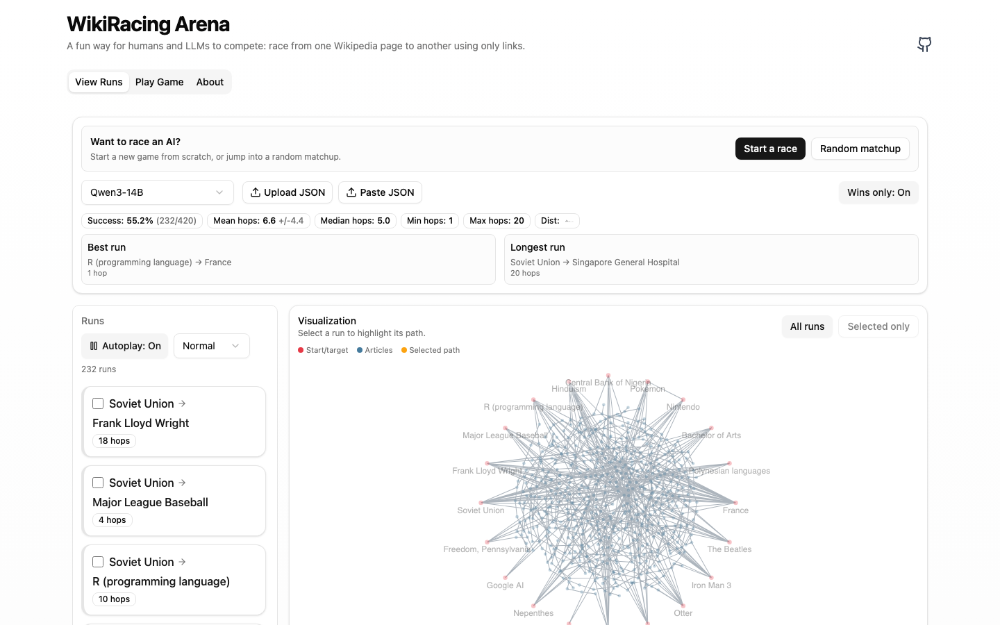
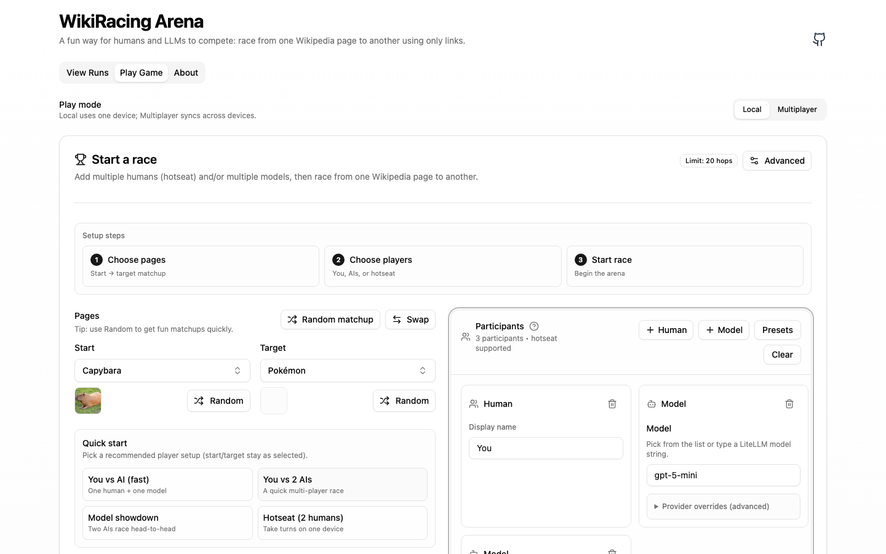

# WikiRacing Arena

Race from one Wikipedia article to another using only hyperlinks — either as a human (hotseat) or with multiple LLMs competing side-by-side.

## Screenshots

**View Runs** (dataset viewer + path visualization)



**Play Game** (race setup)



## What’s in this repo

- **Frontend**: Vite + React + TypeScript UI in `src/`
  - **Play Game**: create a matchup, add humans + models, run races, compare paths
  - **View Runs**: load evaluation JSON, filter/autoplay runs, visualize paths, “Try this path” to jump into gameplay
- **Backend**: FastAPI app in `api.py`
  - Serves article + link data from a local SQLite DB (`wikihop.db`)
  - Optional LLM move generation via LiteLLM (`POST /llm/chat`)
- **Evaluation tooling**: `parallel_eval/` for running batch evals and producing viewer JSON
- **UX audit tooling**: `docs/ux-audit/` + a Playwright script to regenerate screenshots

## How it works (in 60 seconds)

The “Wikipedia” in this project is a pruned snapshot of **Simple Wikipedia**. Each article has a list of outgoing links.
Those links are stored in a SQLite database named `wikihop.db` with a single table:

- `core_articles(title TEXT, links_json TEXT)`

Both the web app and the CLI “game engine” simply:

1. Look up the current article.
2. Present its outgoing links.
3. Choose one link (human click or model choice).
4. Repeat until the destination is reached or a hop limit is hit.

## Local setup

If you like Make targets:

```bash
make install
```

Then, in separate terminals:

```bash
make server
make ui
```

`make server` expects `parallel_eval/wikihop.db` to exist (see step 3 below).

### 1) Install frontend deps

This repo uses Yarn (see `yarn.lock`):

```bash
yarn install
```

### 2) Install Python deps (uv)

This repo uses `uv` for Python environments and dependency management.

```bash
uv sync
```

### 3) Build the `wikihop.db` database (script-only)

The database is generated from Wikimedia SQL dumps (no scraping).

```bash
uv run python get_wikihop.py --wiki simplewiki --dump-date latest --download --output parallel_eval/wikihop.db --overwrite
```

Notes:

- This can take a while (it writes ~350k articles).
- Direct download URLs for `wikihop.db` have been brittle in practice; a 404 saved to disk can look like a file download but causes `SQLITE_NOTADB` when opened.

### 4) Start the API

The API serves graph endpoints used by the web app.

```bash
WIKISPEEDIA_DB_PATH=./parallel_eval/wikihop.db uv run uvicorn api:app --reload --port 8000
```

If you want **LLM participants** to make moves in the web UI, also export a provider key for LiteLLM, e.g.:

```bash
export OPENAI_API_KEY=sk_...
# or: export ANTHROPIC_API_KEY=...
# or: export GEMINI_API_KEY=...
WIKISPEEDIA_DB_PATH=./parallel_eval/wikihop.db uv run uvicorn api:app --reload --port 8000
```

Endpoints you’ll care about:

- `GET /health`
- `GET /get_all_articles`
- `GET /get_article_with_links/{title}`
- `POST /llm/chat` (AI move generation via LiteLLM)

### 5) Start the web app

In a second terminal:

```bash
yarn dev
```

By default the frontend calls the API at `http://localhost:8000`. Override with:

```bash
VITE_API_BASE=http://localhost:8000 yarn dev
```

Open the printed Vite URL (typically `http://localhost:5173`).

Optional (single-server / production-like):

```bash
yarn build
WIKISPEEDIA_DB_PATH=./parallel_eval/wikihop.db uv run uvicorn api:app --port 8000
```

When `dist/` exists, `api.py` serves it automatically.

## Playing the game

### In the browser

1. Open the **Play Game** tab.
2. Choose **Start** and **Target** pages.
3. Pick a recommended participant setup (or add Humans/Models manually).
4. (Optional) Open **Advanced** to adjust race length + LLM budgets.
5. Click **Start race**.

In the Arena:

- Each participant gets a “run” in the leaderboard.
- For human runs, use **Start turn / End turn** to take hotseat turns.
- Use **Save to viewer** to copy selected runs into View Runs.

### Multiplayer (LAN rooms)

Multiplayer rooms let multiple humans on different devices join the **same** race and see a shared leaderboard update live (WebSocket).

Recommended (single-server / production-like):

```bash
make build
WIKISPEEDIA_DB_PATH=./parallel_eval/wikihop.db uv run uvicorn api:app --host 0.0.0.0 --port 8000
```

Or use the convenience target:

```bash
make multiplayer
```

Then:

1) Find the host machine’s LAN IP (e.g. `192.168.1.23`).
2) On other devices, open: `http://<LAN-IP>:8000/`.
3) In **Play Game**, switch to **Multiplayer**, create a room, and share the invite link.

Notes:

- Rooms are stored **in memory** (server restart clears rooms).
- Run with a single uvicorn worker (`--workers 1`) for consistent room state.

### LiteLLM provider cheat sheet

These env vars must be set in the shell where you run the API server.

| Provider | Example `model` string | Key / config env var(s) | Notes |
| --- | --- | --- | --- |
| OpenAI | `gpt-5.2` | `OPENAI_API_KEY` | Uses OpenAI’s hosted API. |
| Anthropic | `anthropic/claude-opus-4-5` | `ANTHROPIC_API_KEY` | Prefix the model with `anthropic/`. |
| Google AI Studio (Gemini) | `gemini/gemini-3-pro-preview` | `GEMINI_API_KEY` (or `GOOGLE_API_KEY`) | Prefix the model with `gemini/`. |
| Google Vertex AI (Gemini) | `vertex_ai/gemini-2.5-pro` | `VERTEXAI_PROJECT`, `VERTEXAI_LOCATION`, credentials (e.g. `GOOGLE_APPLICATION_CREDENTIALS`) | Useful for org/GCP deployments. |
| Local OpenAI-compatible server (vLLM, etc.) | (your server’s model name) | `OPENAI_API_KEY=EMPTY` (often) | Set `api_base` in a model participant’s “Provider overrides (advanced)”. |

LiteLLM supports many more providers; as long as LiteLLM recognizes the `model` string + the corresponding env vars are set, the web UI will work.

### In the CLI

See `parallel_eval/README.md` for full usage.

## Evaluating models and visualizing results

1) Run a batch evaluation with `parallel_eval/proctor.py`.

It produces:

- Per-run traces: `parallel_eval/proctor_tmp/run_*.json`
- A combined summary file: `parallel_eval/proctor_tmp/<proctor-id>-final-results.json`

2) Visualize/compare runs in the web UI:

- Open **View Runs**
- Click **Upload JSON** and select your `*-final-results.json`

The viewer shows success rate and hop statistics, and renders runs as a force-directed graph.

Notes:

- The repo includes a couple of small, checked-in sample result files in `results/` that load by default in **View Runs**.
- The current viewer list/graph focuses on successful runs (`result === "win"`) while still reporting overall success rate.

## What is `index.html`?

`index.html` is the Vite entrypoint for the React app (it mounts `src/main.tsx`).
It isn’t a standalone visualization file — the visualizations live in the React UI.

## Troubleshooting

- **API fails to start / “no such table: core_articles”**:
  - Ensure `WIKISPEEDIA_DB_PATH` points to a valid `wikihop.db` with the expected schema.
- **`SQLITE_NOTADB: file is not a database`**:
  - Your `wikihop.db` is likely an HTML 404/error page saved to disk. Regenerate it with `uv run python get_wikihop.py --output parallel_eval/wikihop.db --overwrite`.

## UX audit screenshots

The repo includes a UX audit folder at `docs/ux-audit/` with screenshots and a recommendations doc.

To regenerate screenshots (requires Playwright):

```bash
npx playwright install chromium

# Make sure both servers are running:
make server
yarn dev

yarn ux:audit
```
