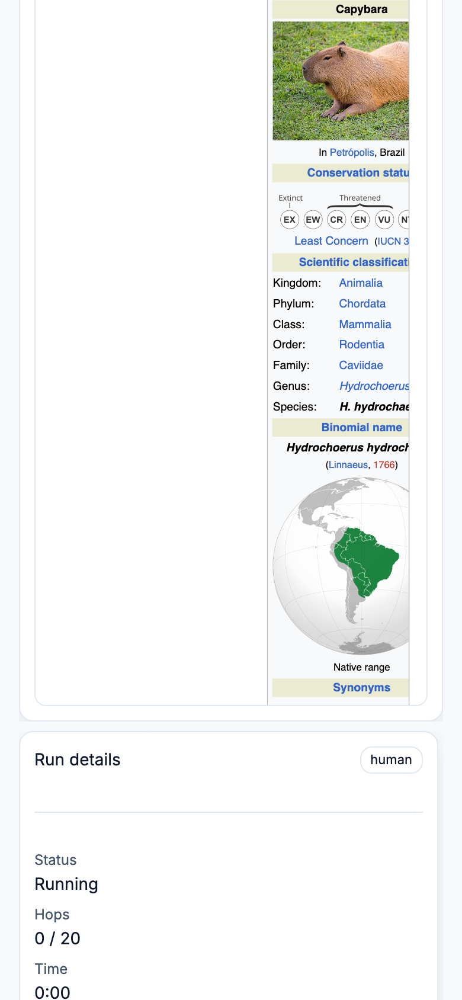

# WikiRacing Arena

Race from one Wikipedia article to another using only hyperlinks — either as a human (hotseat) or with multiple LLMs competing side-by-side.

## Screenshots

**View Runs** (dataset viewer + path visualization)


**Play Game** (race setup)


**Multiplayer** (mobile participant)



## What’s in this repo

- **Frontend**: Vite + React + TypeScript UI in `src/`
  - **Play Game**: create a matchup, add humans + models, run races, compare paths
  - **View Runs**: load evaluation JSON, filter/autoplay runs, visualize paths, “Try this path” to jump into gameplay
  - **Design system**: Tailwind v4 + shadcn/ui primitives, with theme tokens in `src/index.css` (colors, radius, shadows, fonts)
- **Backend**: FastAPI app in `api.py`
  - Serves article + link data from a local SQLite DB (`wikihop.db`)
  - Optional LLM move generation via PydanticAI (used by Local + Multiplayer AI runners; `POST /llm/local_run/step`)
- **Evaluation tooling**: `parallel_eval/` for running batch evals and producing viewer JSON
- **UX audit tooling**: `docs/ux-audit/` + a Playwright script to regenerate screenshots

## How it works (in 60 seconds)

The “Wikipedia” in this project is a pruned snapshot of **Simple Wikipedia**. Each article has a list of outgoing links.
Those links are stored in a SQLite database named `wikihop.db` with a single table:

- `core_articles(title TEXT, links_json TEXT)`

Both the web app and the CLI “game engine” simply:

1. Look up the current article.
2. Present its outgoing links.
3. Choose one link (human click or model choice).
4. Repeat until the destination is reached or a hop limit is hit.

## Local setup

If you like Make targets:

```bash
make install
```

Then, in separate terminals:

```bash
make server
make ui
```

`make server` expects `parallel_eval/wikihop.db` to exist (see step 3 below).

### 1) Install frontend deps

This repo uses Yarn (see `yarn.lock`):

```bash
yarn install
```

### 2) Install Python deps (uv)

This repo uses `uv` for Python environments and dependency management.

```bash
uv sync
```

### 3) Build the `wikihop.db` database (script-only)

The database is generated from Wikimedia SQL dumps (no scraping).

```bash
uv run python get_wikihop.py --wiki simplewiki --dump-date latest --download --output parallel_eval/wikihop.db --overwrite
```

Notes:

- This can take a while (it writes ~350k articles).
- Direct download URLs for `wikihop.db` have been brittle in practice; a 404 saved to disk can look like a file download but causes `SQLITE_NOTADB` when opened.

### 4) Start the API

The API serves graph endpoints used by the web app.

```bash
WIKISPEEDIA_DB_PATH=./parallel_eval/wikihop.db uv run uvicorn api:app --reload --port 8000
```

If you want **LLM participants** to make moves in the web UI, export a provider key (used by PydanticAI), e.g.:

```bash
export OPENAI_API_KEY=sk_...
# or: export ANTHROPIC_API_KEY=...
# or: export GEMINI_API_KEY=...
WIKISPEEDIA_DB_PATH=./parallel_eval/wikihop.db uv run uvicorn api:app --reload --port 8000
```

Endpoints you’ll care about:

- `GET /health`
- `GET /get_all_articles`
- `GET /get_article_with_links/{title}`
- `GET /wiki/{title}` (Wikipedia iframe proxy)
- `POST /local/validate_move` (human move validation; Local)
- `POST /llm/local_run/start` + `POST /llm/local_run/step` (local AI runs)
- Multiplayer rooms: `POST /rooms` + `/rooms/*` (REST + websocket)
- `POST /llm/chat` (direct PydanticAI chat; mostly for debugging)

### 5) Start the web app

In a second terminal:

```bash
yarn dev
```

By default the frontend calls the API at `http://localhost:8000`. Override with:

```bash
VITE_API_BASE=http://localhost:8000 yarn dev
```

Open the printed Vite URL (typically `http://localhost:5173`).

### Playwright (for regression tests + screenshots)

Playwright is used by:

- `make play-game-regression`
- `make ux-audit`

Install browsers:

```bash
yarn playwright install chromium
```

Or:

```bash
make playwright-install
```

(`make play-game-regression` and `make ux-audit` will run `make playwright-install` automatically.)

Optional (single-server / production-like):

```bash
yarn build
WIKISPEEDIA_DB_PATH=./parallel_eval/wikihop.db uv run uvicorn api:app --port 8000
```

When `dist/` exists, `api.py` serves it automatically.

## Regression testing (Play Game)

This repo includes a deterministic Playwright smoke suite for the **Play Game** tab (Local + Multiplayer).

- One-shot (recommended): `make play-game-regression` (starts API + UI, runs assertions, shuts down)
- If servers are already running: `yarn play:regression`
  - Optional: `PLAY_GAME_REGRESSION_BASE_URL=http://localhost:5173 yarn play:regression`

Notes:

- The suite uses a deterministic win path: `Capybara → Rodent` (1 hop).
- Runner source lives in `scripts/play-game-regression-runner.mjs`.
- The wiki iframe can fall back to an offline HTML page generated from the SQLite DB links when external wiki fetches fail, so link-click gameplay remains testable offline.

## Playing the game

### In the browser

1. Open the **Play Game** tab.
2. Choose **Start** and **Target** pages.
3. Pick a recommended participant setup (or add Humans/Models manually).
4. (Optional) Open **Advanced** to adjust race length + LLM budgets.
5. Click **Start race**.

In the Arena:

- Each participant gets a “run” in the leaderboard.
- For human runs, use **Start turn / End turn** to take hotseat turns.
- Use **Save to viewer** to copy selected runs into View Runs.

### Multiplayer (LAN rooms)

Multiplayer rooms let multiple humans on different devices join the **same** race and see a shared leaderboard update live (WebSocket).

Recommended (single-server / production-like):

```bash
make build
WIKISPEEDIA_DB_PATH=./parallel_eval/wikihop.db uv run uvicorn api:app --host 0.0.0.0 --port 8000
```

Or use the convenience target:

```bash
make multiplayer
```

Then:

1) Find the host machine’s LAN IP (e.g. `192.168.1.23`).
2) On other devices, open: `http://<LAN-IP>:8000/`.
3) In **Play Game**, switch to **Multiplayer**, create a room, and share the invite link.

Notes:

- Rooms are stored **in memory** (server restart clears rooms).
- Run with a single uvicorn worker (`--workers 1`) for consistent room state.

### PydanticAI model cheat sheet

These env vars must be set in the shell where you run the API server.

| Provider | Example `model` string | Key / config env var(s) | Notes |
| --- | --- | --- | --- |
| OpenAI (hosted, Responses API) | `openai-responses:gpt-5.2` | `OPENAI_API_KEY` | Default for OpenAI in this repo. |
| OpenAI (Chat Completions) | `openai:gpt-5.2` | `OPENAI_API_KEY` | Useful for OpenAI-compatible servers. |
| Anthropic | `anthropic:claude-3-haiku-20240307` | `ANTHROPIC_API_KEY` | Uses Anthropic’s hosted API. |
| Google AI Studio (Gemini) | `google-gla:gemini-2.0-flash` | `GEMINI_API_KEY` (or `GOOGLE_API_KEY`) | Gemini via Google AI Studio (Generative Language API). |
| Google Vertex AI (Gemini) | `google-vertex:gemini-2.5-pro` | Vertex credentials/config | Useful for org/GCP deployments. |
| OpenRouter | `openrouter:anthropic/claude-3.5-sonnet` | `OPENROUTER_API_KEY` | Token usage is opt-in (handled automatically by the server). |
| Local OpenAI-compatible server (vLLM, etc.) | `openai:<model>` | `OPENAI_API_KEY=EMPTY` (often) | Set `api_base` in a model participant’s “Provider overrides (advanced)”. |

PydanticAI supports many more providers; as long as PydanticAI recognizes the `model` string + the corresponding env vars are set, the web UI will work.

### In the CLI

This repo includes Python tooling under `parallel_eval/` for:

- Playing a single race (human or LLM): `parallel_eval/game.py`
- Running many races in parallel (batch eval): `parallel_eval/proctor.py`

All Python commands are intended to be run via `uv`.

Models use PydanticAI model identifiers (the same provider-prefixed strings used by the web UI).
For OpenAI-compatible endpoints (vLLM, etc.), both scripts support `--api-base` and (optionally) `--openai-api-mode`.

Prereqs:

- Build `parallel_eval/wikihop.db` (see “Build the `wikihop.db` database” above).

### Play a single game

Human (interactive):

```bash
uv run python parallel_eval/game.py --human --start 'Saint Lucia' --end 'Italy' --db parallel_eval/wikihop.db
```

Agent (LLM):

```bash
export OPENAI_API_KEY=sk_...
uv run python parallel_eval/game.py --agent --start 'Saint Lucia' --end 'Italy' --db parallel_eval/wikihop.db --model openai-responses:gpt-5-mini --max-steps 20
```

### Run a parallel evaluation (many games)

`parallel_eval/proctor.py` runs a full cross-product of `article_list × article_list` (excluding same→same), optionally with multiple trials.

Path note: `--db-path`, `--article-list`, and `--output-dir` are resolved relative to the `parallel_eval/` folder.
So when running from the repo root, pass `--db-path wikihop.db` (or omit the flag) rather than `--db-path parallel_eval/wikihop.db`.

Example: evaluate an OpenAI-compatible hosted model with 200 workers:

```bash
uv run python parallel_eval/proctor.py \
  --model 'openai:Qwen/Qwen3-30B-A3B' \
  --api-base 'http://localhost:8000/v1' \
  --workers 200 \
  --db-path wikihop.db
```

Outputs (in `--output-dir`, default `parallel_eval/proctor_tmp`):

- Per-run traces: `parallel_eval/proctor_tmp/run_*.json`
- A combined summary file: `parallel_eval/proctor_tmp/<proctor-id>-final-results.json`

The run files are idempotent: if you re-run the same command, existing run files are skipped.

### Visualize results

1) Start the web app (see “Local setup” above).
2) Open **View Runs** → **Upload JSON** and select your `*-final-results.json`.

Notes:

- The repo includes a couple of small, checked-in sample result files in `results/` that load by default in **View Runs**.
- The current viewer list/graph focuses on successful runs (`result === "win"`) while still reporting overall success rate.

### Shrinking large JSON files

If your results include full LLM conversations in `step.metadata.conversation`, files can get large.
You can strip the conversation payloads while keeping everything needed for visualization:

```bash
jq '{
  article_list: .article_list,
  num_trials: .num_trials,
  num_workers: .num_workers,
  max_steps: .max_steps,
  agent_settings: .agent_settings,
  runs: [.runs[] | {
    model: .model,
    api_base: .api_base,
    max_links: .max_links,
    max_tries: .max_tries,
    result: .result,
    start_article: .start_article,
    destination_article: .destination_article,
    steps: [.steps[] | {
      type: .type,
      article: .article,
      metadata: (if (.metadata | has("conversation")) then (.metadata | del(.conversation)) else .metadata end)
    }]
  }]
}' parallel_eval/proctor_tmp/proctor_1-final-results.json > cleaned_data.json
```

## What is `index.html`?

`index.html` is the Vite entrypoint for the React app (it mounts `src/main.tsx`).
It isn’t a standalone visualization file — the visualizations live in the React UI.

## Troubleshooting

- **API fails to start / “no such table: core_articles”**:
  - Ensure `WIKISPEEDIA_DB_PATH` points to a valid `wikihop.db` with the expected schema.
- **`SQLITE_NOTADB: file is not a database`**:
  - Your `wikihop.db` is likely an HTML 404/error page saved to disk. Regenerate it with `uv run python get_wikihop.py --output parallel_eval/wikihop.db --overwrite`.

## UX audit screenshots

The repo includes a UX audit folder at `docs/ux-audit/` with Playwright-generated screenshots.

To regenerate screenshots (requires Playwright browsers):

```bash
yarn playwright install chromium

# or:
make playwright-install

# One-shot (starts API + UI, runs Playwright, then shuts down)
make ux-audit

# Headed mode
make ux-audit-headed
```

Notes:

- The UX audit script captures **desktop and mobile** layouts, including a **mobile participant** joining a multiplayer room.
- If you prefer to run servers yourself, you can still do:
  - `make server`
  - `yarn dev`
  - `yarn ux:audit`
