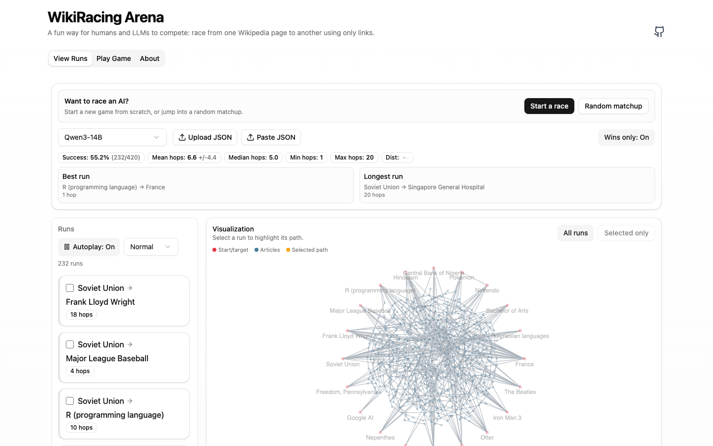
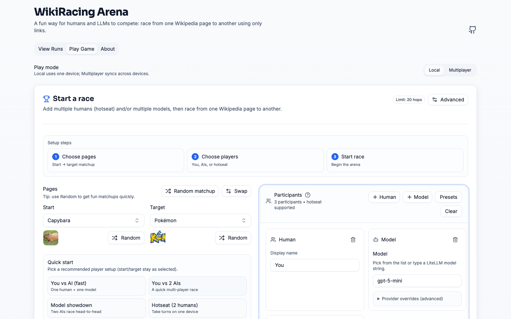
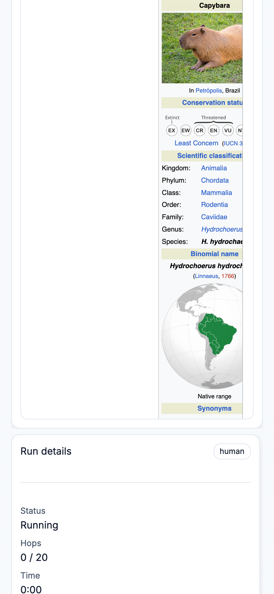

# WikiRacing Arena

Race from one Wikipedia article to another using only hyperlinks — either as a human (hotseat) or with multiple LLMs competing side-by-side.

## Screenshots

**View Runs** (dataset viewer + path visualization)



**Play Game** (race setup)



**Multiplayer** (mobile participant)



## What’s in this repo

- **Frontend**: Vite + React + TypeScript UI in `src/`
  - **Play Game**: create a matchup, add humans + models, run races, compare paths
  - **View Runs**: load evaluation JSON, filter/autoplay runs, visualize paths, “Try this path” to jump into gameplay
  - **Leaderboard**: compare benchmark runs from `public/benchmarks/leaderboard.json`
  - **Design system**: Tailwind v4 + shadcn/ui primitives, with theme tokens in `src/index.css` (colors, radius, shadows, fonts)
- **Backend**: FastAPI app in `api.py`
  - Serves article + link data from a local SQLite DB (`wikihop.db`)
  - Optional LLM move generation via PydanticAI (used by Local + Multiplayer AI runners; `POST /llm/local_run/step`)
- **Evaluation tooling**: `parallel_eval/` for game/proctor runners plus `parallel_eval/benchmark/` for canonical benchmark JSONL, import, summaries, and leaderboard generation
- **Benchmark datasets**: `benchmarks/matchups/` contains the canonical Frontier 200 suite plus generated local matchup sets
- **UX audit tooling**: `docs/ux-audit/` + a Playwright script to regenerate screenshots

## How it works (in 60 seconds)

The “Wikipedia” in this project is a pruned snapshot of **Simple Wikipedia**. Each article has a list of outgoing links.
Those links are stored in a SQLite database named `wikihop.db` with a single table:

- `core_articles(title TEXT, links_json TEXT)`

Both the web app and the CLI “game engine” simply:

1. Look up the current article.
2. Present its outgoing links.
3. Choose one link (human click or model choice).
4. Repeat until the destination is reached or a hop limit is hit.

## Local setup

If you like Make targets:

```bash
make install
```

Then, in separate terminals:

```bash
make server
make ui
```

`make install` auto-builds `parallel_eval/wikihop.db` if it is missing. If you skip `make install`, `make server` expects the DB to already exist (see step 3 below).

### 1) Install frontend deps

This repo uses Yarn (see `yarn.lock`):

```bash
yarn install
```

### 2) Install Python deps (uv)

This repo uses `uv` for Python environments and dependency management.

```bash
uv sync
```

### 3) Build the `wikihop.db` database (script-only)

The database is generated from Wikimedia SQL dumps (no scraping).

```bash
uv run python get_wikihop.py --wiki simplewiki --dump-date latest --download --output parallel_eval/wikihop.db --overwrite
```

Notes:

- This can take a while (it writes ~350k articles).
- Direct download URLs for `wikihop.db` have been brittle in practice; a 404 saved to disk can look like a file download but causes `SQLITE_NOTADB` when opened.

### 3b) Fetch the pinned benchmark DB from GitHub Release (fast path)

If you need the exact DB snapshot used for benchmarking, fetch the published release artifact:

```bash
scripts/fetch-benchmark-db.sh \
  --tag benchmark-db-simplewiki-20260123 \
  --asset-base wikihop-benchmark-simplewiki-20260123 \
  --out parallel_eval/releases/wikihop-benchmark-simplewiki-20260123.db
```

This downloads:

- `wikihop-benchmark-simplewiki-20260123.db.zst`
- `wikihop-benchmark-simplewiki-20260123.db.zst.sha256`
- `wikihop-benchmark-simplewiki-20260123.manifest.json`

Then it verifies the compressed checksum, decompresses the DB, and verifies the final DB checksum against the manifest.

### 4) Start the API

The API serves graph endpoints used by the web app.

```bash
WIKISPEEDIA_DB_PATH=./parallel_eval/wikihop.db uv run uvicorn api:app --reload --port 8000
```

If you want **LLM participants** to make moves in the web UI, set a provider key (used by PydanticAI).

Recommended: create a repo-root `.env` file:

```bash
# .env
OPENAI_API_KEY=sk_...
# or:
# ANTHROPIC_API_KEY=...
# GEMINI_API_KEY=...
# OPENROUTER_API_KEY=...
# Optional global HTTP retry tuning for LLM calls (default attempts=5):
# WIKIRACE_LLM_HTTP_MAX_RETRIES=5
# WIKIRACE_LLM_HTTP_RETRY_INITIAL_DELAY_SECONDS=1.0
# WIKIRACE_LLM_HTTP_RETRY_MAX_DELAY_SECONDS=60.0
# WIKIRACE_LLM_HTTP_RETRY_EXP_BASE=2.0
# WIKIRACE_LLM_HTTP_RETRY_JITTER=1.0
# Optional bounded cancellation draining for hung provider calls / room tasks:
# WIKIRACE_LLM_CANCEL_DRAIN_TIMEOUT_SECONDS=0.25
# WIKIRACE_ROOM_TASK_CANCEL_DRAIN_TIMEOUT_SECONDS=0.5
# Optional (enables trace export to Logfire):
LOGFIRE_TOKEN=...
```

`.env` values take precedence over existing environment variables for `*_API_KEY` and `LOGFIRE_TOKEN` (when set to a non-empty value). Alternatively, export in your shell:

```bash
export OPENAI_API_KEY=sk_...
# or:
# export ANTHROPIC_API_KEY=...
# export GEMINI_API_KEY=...
# export OPENROUTER_API_KEY=...
# Optional:
export LOGFIRE_TOKEN=...
```

Endpoints you’ll care about:

- `GET /health`
- `GET /get_all_articles`
- `GET /get_article_with_links/{title}`
- `GET /resolve_article/{title}` + `GET /canonical_title/{title}` (title resolution/canonicalization helpers)
- `GET /wiki/{title}` (iframe wiki proxy; fetches live Simple Wikipedia HTML)
- `POST /local/validate_move` (human move validation; Local)
- `POST /llm/local_run/start` + `POST /llm/local_run/step` + `POST /llm/local_run/end` (local AI runs + trace lifecycle)
- Multiplayer rooms: `POST /rooms` + `/rooms/*` (REST + websocket)
- `POST /llm/chat` (direct PydanticAI chat; mostly for debugging)

If you expose the API through a reverse proxy and set `WIKIRACE_PUBLIC_HOST` to a non-loopback hostname, also set `WIKIRACE_LLM_PROXY_SHARED_SECRET` and make the proxy inject `X-Wikirace-Llm-Proxy-Secret` on trusted internal requests. In that mode, bare loopback heuristics for `/llm/*` are disabled on purpose so a proxy that rewrites `Host` to `localhost` cannot accidentally reopen server-side model access to remote callers.

If the in-game wiki iframe shows `Fetch error: Failed to fetch wiki page ...`, your network (or a proxy/WAF) may be blocking automated fetches. Try setting:

```bash
# Use a descriptive UA with contact info if possible (Wikimedia etiquette).
export WIKIRACE_WIKI_USER_AGENT='wikirace-arena (your email or URL here)'

# If you're behind a corporate proxy, also set HTTP(S)_PROXY and keep this enabled:
export WIKIRACE_WIKI_TRUST_ENV=1
```

### 5) Start the web app

In a second terminal:

```bash
yarn dev
```

By default the frontend calls the API at `http://localhost:8000`. Override with:

```bash
VITE_API_BASE=http://localhost:8000 yarn dev
```

Open the printed Vite URL (typically `http://localhost:5173`).

### Playwright (for regression tests + screenshots)

Playwright is used by:

- `make play-game-regression`
- `make ux-audit`

Install browsers:

```bash
yarn playwright install chromium
```

Or:

```bash
make playwright-install
```

(`make play-game-regression` and `make ux-audit` will run `make playwright-install` automatically.)

Optional (single-server / built-UI smoke):

```bash
yarn build
WIKISPEEDIA_DB_PATH=./parallel_eval/wikihop.db uv run uvicorn api:app --port 8000
```

When `dist/` exists, `api.py` serves it automatically.

Other useful Make targets:

- `make ui-lan` (Vite on `0.0.0.0:5173`)
- `make server-lan` (API on `0.0.0.0:8000`)
- `make multiplayer` (build + LAN-hosted API)
- `make test` (`yarn test` -> lint + typecheck + build)
- `make lint` (`yarn lint` + `uv run ruff check . --fix`)

## Regression testing (Play Game)

This repo includes a deterministic Playwright smoke suite for the **Play Game** tab (Local + Multiplayer).

- One-shot (recommended): `make play-game-regression` (starts API + UI, runs assertions, shuts down)
- If servers are already running: `yarn play:regression`
  - Optional: `PLAY_GAME_REGRESSION_BASE_URL=http://localhost:5173 yarn play:regression`

Notes:

- The suite uses a deterministic win path: `Capybara → Rodent` (1 hop).
- Runner source lives in `scripts/play-game-regression-runner.mjs`.
- The wiki iframe can fall back to an offline HTML page generated from the SQLite DB links when external wiki fetches fail, so link-click gameplay remains testable offline.

## Playing the game

### In the browser

1. Open the **Play Game** tab.
2. Choose **Start** and **Target** pages.
3. Pick a recommended participant setup (or add Humans/Models manually).
4. (Optional) Open **Advanced** to adjust race length + LLM budgets.
5. Click **Start race**.

In the Arena:

- Each participant gets a “run” in the leaderboard.
- For human runs, use **Start turn / End turn** to take hotseat turns.
- Use **Save to viewer** to copy selected runs into View Runs.

### Multiplayer (LAN rooms)

Multiplayer rooms let multiple humans on different devices join the **same** race and see a shared leaderboard update live (WebSocket).

Recommended (single-server / built UI):

```bash
make build
WIKISPEEDIA_DB_PATH=./parallel_eval/wikihop.db uv run uvicorn api:app --host 0.0.0.0 --port 8000
```

Or use the convenience target:

```bash
make multiplayer
```

Then:

1) Find the host machine’s LAN IP (e.g. `192.168.1.23`).
2) On other devices, open: `http://<LAN-IP>:8000/`.
3) In **Play Game**, switch to **Multiplayer**, create a room, and share the invite link.

Notes:

- Rooms are stored **in memory** (server restart clears rooms).
- Run with a single uvicorn worker (`--workers 1`) for consistent room state.

### PydanticAI model cheat sheet

These env vars must be set in the shell where you run the API server.

| Provider | Example `model` string | Key / config env var(s) | Notes |
| --- | --- | --- | --- |
| OpenAI (hosted, Responses API) | `openai-responses:gpt-5.2` | `OPENAI_API_KEY` | Default for OpenAI in this repo. |
| OpenAI (Chat Completions) | `openai:gpt-5.2` | `OPENAI_API_KEY` | Useful for OpenAI-compatible servers. |
| Anthropic | `anthropic:claude-3-haiku-20240307` | `ANTHROPIC_API_KEY` | Uses Anthropic’s hosted API. |
| Google AI Studio (Gemini) | `google-gla:gemini-3-flash-preview` | `GEMINI_API_KEY` (or `GOOGLE_API_KEY`) | Gemini via Google AI Studio (Generative Language API). |
| Google Vertex AI (Gemini) | `google-vertex:gemini-3-pro-preview` | Vertex credentials/config | Useful for org/GCP deployments. |
| OpenRouter | `openrouter:anthropic/claude-4.5-sonnet` | `OPENROUTER_API_KEY` | Token usage is opt-in (handled automatically by the server). |
| Local OpenAI-compatible server (vLLM, etc.) | `openai:<model>` | `OPENAI_API_KEY=EMPTY` (often) | Set `api_base` in a model participant’s “Provider overrides (advanced)”. |

PydanticAI supports many more providers; as long as PydanticAI recognizes the `model` string + the corresponding env vars are set, the web UI will work.

### In the CLI

This repo includes Python tooling under `parallel_eval/` for:

- Playing a single race (human or LLM): `parallel_eval/game.py`
- Running many races in parallel (batch eval): `parallel_eval/proctor.py`

All Python commands are intended to be run via `uv`.

Models use PydanticAI model identifiers (the same provider-prefixed strings used by the web UI).
For OpenAI-compatible endpoints (vLLM, etc.), both scripts support `--api-base` and (optionally) `--openai-api-mode`.

Prereqs:

- Build `parallel_eval/wikihop.db` (see “Build the `wikihop.db` database” above).

### Play a single game

Human (interactive):

```bash
uv run python parallel_eval/game.py --human --start 'Saint Lucia' --end 'Italy' --db parallel_eval/wikihop.db
```

Agent (LLM):

```bash
export OPENAI_API_KEY=sk_...
uv run python parallel_eval/game.py --agent --start 'Saint Lucia' --end 'Italy' --db parallel_eval/wikihop.db --model openai-responses:gpt-5-mini --max-steps 20
```

### Run a parallel evaluation (many games)

`parallel_eval/proctor.py` runs a full cross-product of `article_list × article_list` (excluding same→same), optionally with multiple trials.

Path note: `--db-path`, `--article-list`, and `--output-dir` are resolved relative to the `parallel_eval/` folder.
So when running from the repo root, pass `--db-path wikihop.db` (or omit the flag) rather than `--db-path parallel_eval/wikihop.db`.

Example: evaluate an OpenAI-compatible hosted model with 200 workers:

```bash
uv run python parallel_eval/proctor.py \
  --model 'openai:Qwen/Qwen3-30B-A3B' \
  --api-base 'http://localhost:8000/v1' \
  --workers 200 \
  --db-path wikihop.db
```

Outputs (in `--output-dir`, default `parallel_eval/proctor_tmp`):

- Per-run traces: `parallel_eval/proctor_tmp/run_*.json`
- A combined summary file: `parallel_eval/proctor_tmp/<proctor-id>-final-results.json`

The run files are idempotent: if you re-run the same command, existing run files are skipped.

### Benchmarking (matchup datasets)

`python -m parallel_eval.benchmark` runs structured benchmark datasets and produces canonical JSONL + summary files.
The standard SOTA-separating benchmark lives under `benchmarks/matchups/frontier_local_simplewiki_standard_v1/`.
This Frontier 200 suite is the only benchmark exposed in docs, defaults, and the web leaderboard UI.
For reproducible official runs, use the frozen benchmark DB artifact at
`parallel_eval/releases/wikihop-benchmark-simplewiki-20260123.db` rather than the mutable app DB at `parallel_eval/wikihop.db`.

**Basic usage:**

```bash
uv run python -m parallel_eval.benchmark run \
  --dataset benchmarks/matchups/frontier_local_simplewiki_standard_v1/all.jsonl \
  --model openai-responses:gpt-5.2
```

This prints the output JSONL path (auto-generated under `results/benchmarks/`).
To force a specific filename, pass `--out ...` (errors if it already exists unless `--overwrite`).

**Provider-specific reasoning/thinking options:**

OpenAI (with reasoning effort):

```bash
uv run python -m parallel_eval.benchmark run \
  --dataset benchmarks/matchups/frontier_local_simplewiki_standard_v1/all.jsonl \
  --model openai-responses:gpt-5.2 \
  --openai-reasoning-effort medium \
  --tag "effort-medium"
```

Common `--openai-reasoning-effort` values: `none`, `low`, `medium`, `high`, `xhigh` (provider/model support varies).

You can also add `--openai-reasoning-summary` for reasoning summary configuration.

Anthropic (with extended thinking):

```bash
uv run python -m parallel_eval.benchmark run \
  --dataset benchmarks/matchups/frontier_local_simplewiki_standard_v1/all.jsonl \
  --model anthropic:claude-sonnet-4-20250514 \
  --anthropic-thinking-budget-tokens 10000 \
  --tag "thinking-10k"
```

Google (with thinking config):

```bash
# Create a thinking config JSON file:
echo '{"thinking_budget": 8192}' > /tmp/google-thinking.json

uv run python -m parallel_eval.benchmark run \
  --dataset benchmarks/matchups/frontier_local_simplewiki_standard_v1/all.jsonl \
  --model google-gla:gemini-3-flash-preview \
  --google-thinking-config /tmp/google-thinking.json \
  --tag "thinking-8192"
```

**OpenAI-compatible endpoints (vLLM, etc.):**

```bash
uv run python -m parallel_eval.benchmark run \
  --dataset benchmarks/matchups/frontier_local_simplewiki_standard_v1/all.jsonl \
  --model openai:Qwen/Qwen3-30B-A3B \
  --api-base http://localhost:8000/v1 \
  --tag "vllm"
```

**Other useful options:**

- `--setup-id classic_local_v1` — use the app-mirroring Local / Classic contract (default)
- `--slice-id core_rank_v1` — filter a multi-slice dataset down to one named slice
- `--concurrency N` — parallel matchup runners (default: 1 for stable comparisons)
- `--max-hops N` — maximum hops per game (default comes from the setup)
- `--max-tokens N` — LLM token limit
- `--store-raw-output {none,truncated,full}` — control how much raw LLM output is persisted
- `--tag LABEL` — add a label to auto-generated output filenames

**Other subcommands:**

```bash
# Generate a new matchup dataset
uv run python -m parallel_eval.benchmark generate-matchups \
  --out benchmarks/matchups/custom.jsonl

# Summarize existing benchmark JSONL into .summary.json and .viewer.json
uv run python -m parallel_eval.benchmark summarize results/benchmarks/<run>.jsonl

# Render one or more benchmark JSONLs into a text-first report
uv run python -m parallel_eval.benchmark report-text \
  --inputs results/benchmarks/<run>.jsonl \
  --slice-id core_rank_v1 \
  --out results/benchmarks/report.md

# Import Arena "Viewer JSON" exports into canonical benchmark JSONL
uv run python -m parallel_eval.benchmark import-viewer path/to/viewer-export.json

# Import exported race/session JSON into canonical benchmark JSONL
uv run python -m parallel_eval.benchmark import-session path/to/session-export.json

# Compute shortest-path metadata for a matchup dataset
uv run python -m parallel_eval.benchmark compute-shortest-paths \
  --dataset benchmarks/matchups/frontier_local_simplewiki_standard_v1/all.jsonl \
  --out results/benchmarks/frontier_local_simplewiki_standard_v1.with-shortest-paths.jsonl

# Probe suite feasibility on the current DB
uv run python -m parallel_eval.benchmark probe-fixed-suite \
  --db-path parallel_eval/releases/wikihop-benchmark-simplewiki-20260123.db \
  --suite-id frontier_local_simplewiki_standard_v1

# Generate or refresh the graph-native fixed suite
uv run python -m parallel_eval.benchmark generate-fixed-suite \
  --db-path parallel_eval/releases/wikihop-benchmark-simplewiki-20260123.db \
  --suite-id frontier_local_simplewiki_standard_v1 \
  --out-dir benchmarks/matchups/frontier_local_simplewiki_standard_v1

# Run one effort lane of the OpenAI benchmark matrix
.venv/bin/python scripts/run_benchmark_matrix.py \
  --dataset benchmarks/matchups/frontier_local_simplewiki_standard_v1/all.jsonl \
  --db-path parallel_eval/releases/wikihop-benchmark-simplewiki-20260123.db \
  --bundle-dir results/benchmarks/frontier_local_simplewiki_standard_v1_matrix_lanes/none \
  --efforts none \
  --no-publish

# Merge finished effort lanes into the published leaderboard
.venv/bin/python scripts/merge_benchmark_matrix.py \
  --bundle-dirs \
    results/benchmarks/frontier_local_simplewiki_standard_v1_matrix_lanes/none \
    results/benchmarks/frontier_local_simplewiki_standard_v1_matrix_lanes/low \
    results/benchmarks/frontier_local_simplewiki_standard_v1_matrix_lanes/medium \
    results/benchmarks/frontier_local_simplewiki_standard_v1_matrix_lanes/high \
    results/benchmarks/frontier_local_simplewiki_standard_v1_matrix_lanes/xhigh \
  --out-dir results/benchmarks/frontier_local_simplewiki_standard_v1_matrix_bundle
```

### Building a leaderboard

Merge multiple benchmark runs into a single leaderboard JSON:

```bash
.venv/bin/python scripts/merge_benchmark_matrix.py \
  --bundle-dirs \
    results/benchmarks/frontier_local_simplewiki_standard_v1_matrix_lanes/none \
    results/benchmarks/frontier_local_simplewiki_standard_v1_matrix_lanes/low \
    results/benchmarks/frontier_local_simplewiki_standard_v1_matrix_lanes/medium \
    results/benchmarks/frontier_local_simplewiki_standard_v1_matrix_lanes/high \
    results/benchmarks/frontier_local_simplewiki_standard_v1_matrix_lanes/xhigh \
  --out-dir results/benchmarks/frontier_local_simplewiki_standard_v1_matrix_bundle
```

If you already have a custom set of `records.jsonl` files and want to build a leaderboard directly:

```bash
uv run python -m parallel_eval.benchmark leaderboard \
  --inputs $(find results/benchmarks -name records.jsonl -print) \
  --dataset-id matchups/frontier_local_simplewiki_standard_v1/all \
  --viewer-out-dir public/benchmarks/viewers \
  --viewer-url-prefix /benchmarks/viewers \
  --out results/benchmarks/leaderboard.json
```

The output JSON contains aggregated stats per model (overall + per-slice buckets), including win rates, hop stats, token stats, latency stats, behavior fingerprints, weakness slices, suite metadata, and a compatibility `legacy_score_v1`.

#### Visualize the leaderboard in the website

The web UI reads a generated, git-ignored **static** leaderboard file from:

- `public/benchmarks/leaderboard.json`

To update the site after generating a new leaderboard:

```bash
mkdir -p public/benchmarks
cp results/benchmarks/leaderboard.json public/benchmarks/leaderboard.json

# Or materialize and publish the canonical Frontier 200 public bundle from
# exact source runs that already exist on disk.
.venv/bin/python scripts/publish_frontier_standard_bundle.py
```

Then open the **Leaderboard** tab in the app (next to **View Runs** and **Play Game**). It supports:

- Dataset filtering and setup filtering
- Slice selection (for example `core_rank_v1`)
- Pass-rate snapshot, frontier charts, loss-spend hotspots
- Focused model analysis with weakness slices, behavior fingerprints, and representative moves
- Viewer drilldown via copied `viewer.json` artifacts

For UI validation of the benchmark dashboard itself:

```bash
yarn play:benchmark-dashboard --base-url http://localhost:5173
```
- Sorting and text filtering

#### Publishing/updating benchmark DB release artifacts

To publish the current local DB as a benchmark artifact release:

```bash
scripts/publish-benchmark-db.sh \
  --db-path parallel_eval/wikihop.db \
  --wiki simplewiki \
  --dump-date 20260123
```

Defaults:

- Release tag: `benchmark-db-<wiki>-<dump-date>`
- Asset base: `wikihop-benchmark-<wiki>-<dump-date>`

For the current pinned benchmark DB this resolves to:

- Tag: `benchmark-db-simplewiki-20260123`
- Asset base: `wikihop-benchmark-simplewiki-20260123`

#### Score calculation

Scores are computed **per matchup** and then aggregated.

- Per matchup:
  - If `result !== "win"` → `0`
  - If `result === "win"` → `base - α*hops - β*log1p(total_tokens) - γ*log1p(duration_ms)`
- Aggregation:
  - `score_sum` is the sum of per-matchup scores (overall and per-tier).

Default weights (also recorded in the output JSON):

- `base = 1000`
- `α (alpha_hops) = 20`
- `β (beta_log1p_tokens) = 25`
- `γ (gamma_log1p_duration_ms) = 15`

Notes:

- If `total_tokens` or `duration_ms` is missing (`null`), its penalty term is skipped for that run.

### Benchmark unit tests

`parallel_eval/benchmark/` includes a Python unit-test suite.

```bash
uv run python -m unittest discover parallel_eval/benchmark/tests -p 'test_*.py'
```

### Visualize results

1) Start the web app (see “Local setup” above).
2) Open **View Runs** → **Upload JSON** and select your `*-final-results.json`.

Notes:

- The repo includes a couple of small, checked-in sample result files in `src/data/viewer/` that load by default in **View Runs**.
- The current viewer list/graph focuses on successful runs (`result === "win"`) while still reporting overall success rate.

### Shrinking large JSON files

If your results include full LLM conversations in `step.metadata.conversation`, files can get large.
You can strip the conversation payloads while keeping everything needed for visualization:

```bash
jq '{
  article_list: .article_list,
  num_trials: .num_trials,
  num_workers: .num_workers,
  max_steps: .max_steps,
  agent_settings: .agent_settings,
  runs: [.runs[] | {
    model: .model,
    api_base: .api_base,
    max_links: .max_links,
    max_tries: .max_tries,
    result: .result,
    start_article: .start_article,
    destination_article: .destination_article,
    steps: [.steps[] | {
      type: .type,
      article: .article,
      metadata: (if (.metadata | has("conversation")) then (.metadata | del(.conversation)) else .metadata end)
    }]
  }]
}' parallel_eval/proctor_tmp/proctor_1-final-results.json > cleaned_data.json
```

## What is `index.html`?

`index.html` is the Vite entrypoint for the React app (it mounts `src/main.tsx`).
It isn’t a standalone visualization file — the visualizations live in the React UI.

## Troubleshooting

- **API fails to start / “no such table: core_articles”**:
  - Ensure `WIKISPEEDIA_DB_PATH` points to a valid `wikihop.db` with the expected schema.
- **`SQLITE_NOTADB: file is not a database`**:
  - Your `wikihop.db` is likely an HTML 404/error page saved to disk. Regenerate it with `uv run python get_wikihop.py --output parallel_eval/wikihop.db --overwrite`.

## UX audit screenshots

The repo includes a UX audit folder at `docs/ux-audit/` with Playwright-generated screenshots.

To regenerate screenshots (requires Playwright browsers):

```bash
yarn playwright install chromium

# or:
make playwright-install

# One-shot (starts API + UI, runs Playwright, then shuts down)
make ux-audit

# Headed mode
make ux-audit-headed
```

Notes:

- The UX audit script captures **desktop and mobile** layouts, including a **mobile participant** joining a multiplayer room.
- If you prefer to run servers yourself, you can still do:
  - `make server`
  - `yarn dev`
  - `yarn ux:audit`
